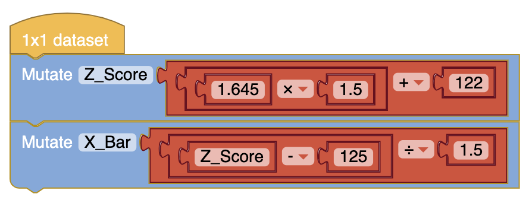

# 2018 Section II Part A 
https://secure-media.collegeboard.org/ap/pdf/ap18-statistics-q6.pdf

# Question 6

Systolic blood pressure is the amount of pressure that blood exerts on blood vessels while the heart is beating.
The mean systolic blood pressure for people in the United States is reported to be 122 millimeters of mercury
(mmHg) with a standard deviation of 15 mmHg.

The wellness department of a large corporation is investigating whether the mean systolic blood pressure of
its employees is greater than the reported national mean. A random sample of 100 employees will be selected,
the systolic blood pressure of each employee in the sample will be measured, and the sample mean will be
calculated.

Let µ represent the mean systolic blood pressure of all employees at the corporation. Consider the following
hypotheses: 

H_0: µ = 122
H_0: µ > 122.

#### (a)  Describe a Type II error in the context of the hypothesis test
#### (b) Assume that er, the standard deviation of the systolic blood pressure of all employees at the corporation, is
15 mmHg. If µ = 122, the sampling distribution of x for samples of size 100 is approximately normal with
a mean of 122 mmHg and a standard deviation of 1.5 mmHg. What values of the sample mean x_bar would
represent sufficient evidence to reject the null hypothesis at the signifi.cance level of a = 0.05 ? 

The actual mean systolic blood pressure of all employees at the corporation is 15 mmHg, not the hypothesized
value of 122 mmHg, and the standard deviation is 15mmHg. 

#### (c) Using the actual mean of 125 mmHg !illd the results from part (b), determine the probability that the null
hypothesis will be rejected.

#### (d) What is the statistical term for the probability found in part (c)?

#### (e) Suppose the size of the sample of employees to be selected is greater than 100. Would the probability of rejecting
the null hypothesis be greater than, less than, or equal to the probability calculated in part (c)?

# TidyBlocks Answer 

#### (a)
**Theoretical, cannot answer with TidyBlocks**
#### (b)

#### (c)

#### (d)
**Theoretical, cannot answer with TidyBlocks**
#### (e)
**Can we answer this with blocks? Create a workspace to play with different values?**
