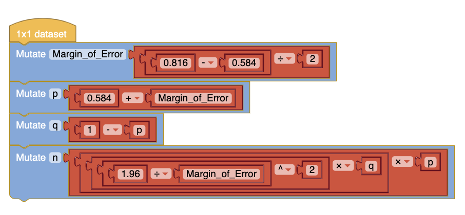
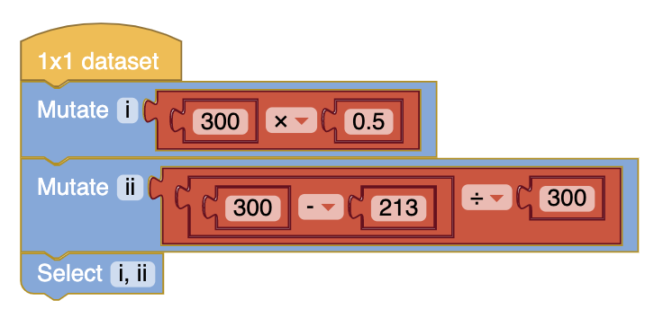

# 2018 Section II Part A 
https://secure-media.collegeboard.org/ap/pdf/ap18-statistics-q2.pdf

# Question 2

An environmental science teacher at a high school with a large population of students wanted to estimate the
proportion of students at the school who regularly recycle plastic bottles. The teacher selected a random sample
of students at the school to survey. Each selected student went intothe teacher's office, one at a time,- and was
asked to respond yes or no to the following question:

*Do you regularly recycle plastic bottles?*

#### (a) How many students were in the sample selected by the environmental science teacher?

#### (b) Given the method used by the environmental science teacher to collect the responses, explain how bias
might have been introduced and describe how the bias might affect the point estimate of the proportion of all
students at the school who would respond yes to the question. 

#### (c) The statistics teacher at the high school was concerned about the potential bias in the survey. To obtain a
potentially less biased estimate of the proportion, the statistics teacher used an alternate method for
collecting student responses. A random sample of 300 students was selected, and each student was given the
following instructions on how to respond to the question:

* In private, flip a fair coin
* If heads, you must respond no, regardless of whether you regularly recycle
* If tails please truthfully respond yes or no

## (i) What is the expected number of students from the sample of 300 who would be required to respond no
because the coin flip resulted in heads?
## (ii) The results of the. sample showed that 213 of the 30 selected stuq�nts responded no. Based on the
results of the sample, give a point estimate for the proportion of all students at the high school who
would respond to the question.

# TidyBlocks Answer 

### (a)

### (c)

